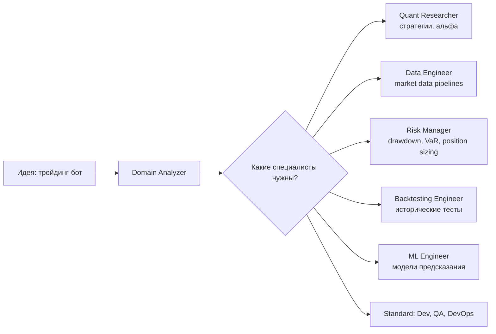
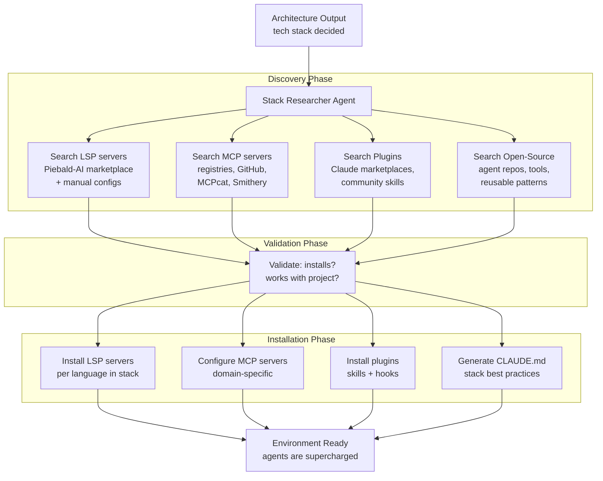
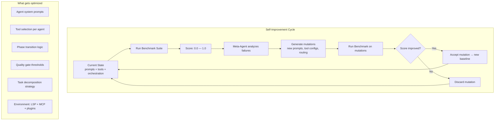
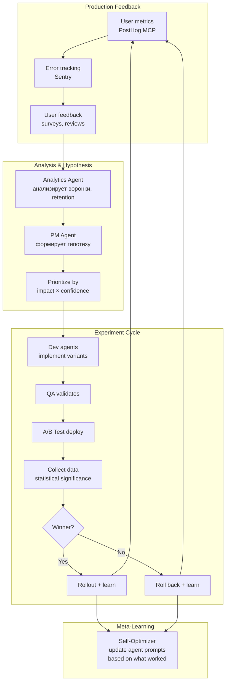
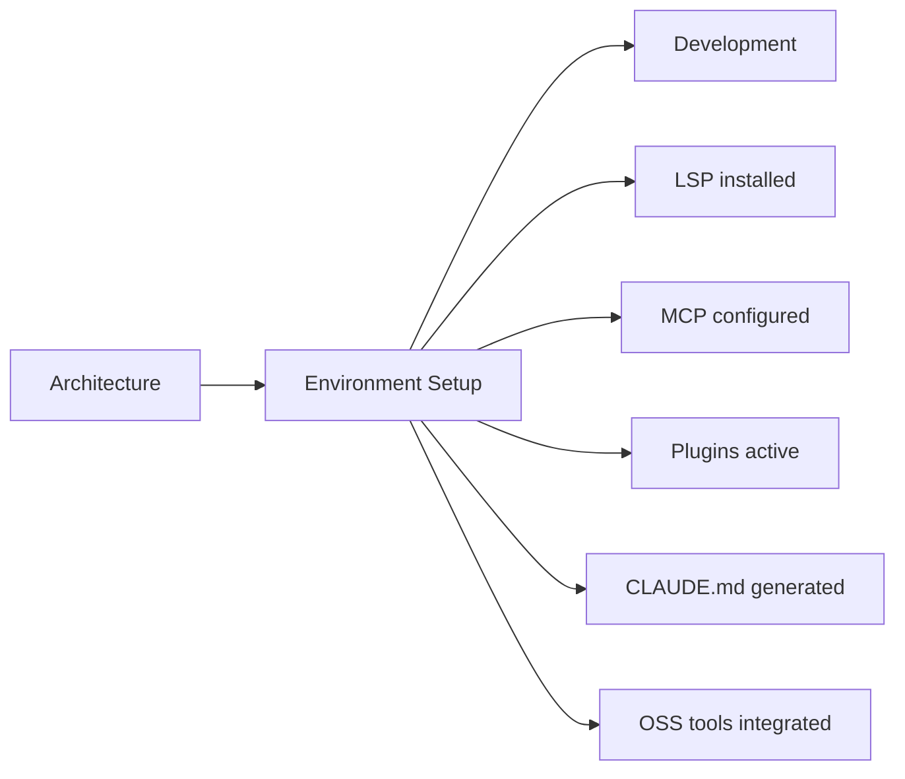

# Autonomous Development System on Claude Agent SDK

## Context

Цель — построить самоулучшающуюся систему агентов поверх Claude Agent SDK, которая:
1. Берёт идею и автономно проходит полный цикл: спецификация → архитектура → разработка → тестирование → деплой → A/B тесты → итерации
2. **Динамически создаёт специализированных агентов** под конкретный домен проекта (кванты, математика, data science, ML, трейдинг и т.д.) — не фиксированный набор ролей
3. **Самоулучшается** по модели AutoAgent — мета-агент оптимизирует промпты, инструменты и оркестрацию на основе бенчмарков, сохраняя улучшения между итерациями
4. **Автоматически настраивает окружение** — Stack Researcher ищет и устанавливает оптимальные LSP серверы, MCP серверы, плагины, навыки и паттерны из открытых источников под конкретный стек проекта

TypeScript — основной язык (полная поддержка hooks: `TaskCompleted`, `TeammateIdle`, `SessionStart/End`).

---

## Architecture

```
┌─────────────────────────────────────────────────────────────────────────┐
│                            CLI / Web UI                                  │
│                   (idea input, progress dashboard)                       │
└────────────────────────────────┬────────────────────────────────────────┘
                                 │
                                 ▼
┌─────────────────────────────────────────────────────────────────────────┐
│                         META-ORCHESTRATOR                                │
│               (самоулучшающийся координатор всей системы)                 │
│                                                                         │
│  ┌──────────┐ ┌──────────┐ ┌──────────┐ ┌──────────┐ ┌─────────────┐   │
│  │ Phase    │ │ Agent    │ │ Self-    │ │ Stack    │ │ Benchmark   │   │
│  │ Machine  │ │ Factory  │ │ Optimizer│ │ Research.│ │ Evaluator   │   │
│  └──────────┘ └──────────┘ └──────────┘ └──────────┘ └─────────────┘   │
│  ┌──────────┐ ┌──────────┐ ┌──────────┐                                │
│  │ Quality  │ │ State    │ │ Hook     │                                │
│  │ Gates    │ │ Store    │ │ Engine   │                                │
│  └──────────┘ └──────────┘ └──────────┘                                │
└────────────────────────────────┬────────────────────────────────────────┘
                                 │
          ┌──────────────────────┼──────────────────────┐
          ▼                      ▼                      ▼
 ┌──────────────┐      ┌──────────────┐      ┌──────────────┐
 │ Agent Factory │      │    Stack     │      │ Self-Improve │
 │ (generates   │      │  Researcher  │      │ Loop         │
 │  agents on   │      │ (LSP, MCP,   │      │ (AutoAgent-  │
 │  demand)     │      │  plugins,    │      │  style)      │
 └──────┬───────┘      │  open-source)│      └──────────────┘
        │               └──────┬───────┘
        │ spawns dynamically   │ installs & configures
 ┌──────┼──────┬───────┐       │
 ▼      ▼      ▼       ▼      ▼
┌────┐┌────┐┌────┐┌─────┐  ┌─────────────────────────────┐
│ PM ││Dev ││ QA ││Quant│  │ Discovered Environment      │
└────┘└────┘└────┘└─────┘  │ ┌─────┐┌─────┐┌──────────┐  │
   dynamic agents           │ │ LSP ││ MCP ││ Plugins  │  │
                            │ │srvrs││srvrs││& Skills  │  │
                            │ └─────┘└─────┘└──────────┘  │
                            └─────────────────────────────┘
```

---

## Четыре ключевых отличия от стандартного подхода

### 1. Agent Factory — динамическое создание агентов

Вместо фиксированного набора ролей (PM, Dev, QA) система **анализирует домен проекта** и генерирует специализированных агентов на лету.



**Как это работает:**

**`src/agents/factory.ts`** — Agent Factory:
```typescript
interface AgentBlueprint {
  name: string;
  role: string;
  systemPrompt: string;     // сгенерирован мета-агентом
  tools: string[];
  mcpServers?: Record<string, MCPConfig>;
  model?: "opus" | "sonnet" | "haiku";
  evaluationCriteria: string[];  // для self-improvement
}

// Domain Analyzer вызывается на этапе Ideation
// Он анализирует идею и генерирует blueprints нужных агентов
async function analyzeAndCreateAgents(idea: string, spec: ProductSpec): Promise<AgentBlueprint[]> {
  const result = await query({
    prompt: `Analyze this project idea and determine what specialized agents 
             are needed beyond standard (PM, Dev, QA, DevOps, Reviewer).
             
             Idea: ${idea}
             Spec: ${JSON.stringify(spec)}
             
             For each agent, output a JSON blueprint with:
             - name, role, detailed systemPrompt
             - required tools and MCP servers
             - evaluation criteria (how to measure this agent's quality)
             
             Examples of domain-specific agents:
             - Trading: Quant Researcher, Risk Manager, Backtesting Engineer
             - Math-heavy: Mathematician, Formal Verifier, Numerical Analyst  
             - Data: Data Engineer, ML Engineer, Feature Engineer
             - Finance: Compliance Officer, Regulatory Analyst
             - Healthcare: Clinical Protocol Validator
             
             Output ONLY agents that this specific project needs.`,
    options: { allowedTools: ["WebSearch", "WebFetch"] }
  });
  
  return parseBlueprints(result);
}
```

**`src/agents/registry.ts`** — Agent Registry:
```typescript
// Реестр хранит все доступные blueprints + их performance history
interface AgentRegistry {
  blueprints: Map<string, AgentBlueprint>;
  performanceHistory: Map<string, AgentPerformance[]>;
  
  register(blueprint: AgentBlueprint): void;
  spawn(name: string): AgentDefinition;  // → Agent SDK AgentDefinition
  evolve(name: string, feedback: EvalResult): AgentBlueprint;  // → улучшенный blueprint
}
```

Blueprints персистятся в `.autonomous-dev/agents/` как `.md` файлы и автоматически подхватываются Agent SDK как subagent definitions.

### 2. Stack Researcher — автонастройка окружения агентов

После Architecture phase (когда известен tech stack), запускается **Stack Researcher** — агент, который ищет и устанавливает оптимальное окружение для всех агентов.

**Зачем:** Те же агенты с правильными LSP/MCP/плагинами работают кратно эффективнее. LSP даёт навигацию по коду за 50ms вместо 45 секунд grep'ом. MCP серверы дают прямой доступ к базам, браузеру, аналитике. Плагины добавляют готовые skills (code review, deployment workflows и т.д.).



**`src/agents/stack-researcher.ts`**:
```typescript
interface StackEnvironment {
  lspServers: LSPConfig[];       // языковые серверы для проекта
  mcpServers: MCPConfig[];       // MCP серверы (базы, браузер, аналитика и т.д.)
  plugins: PluginConfig[];       // плагины с навыками и хуками
  openSourceTools: OSSTool[];    // инструменты из open-source
  claudeMd: string;              // сгенерированный CLAUDE.md с best practices
}

interface LSPConfig {
  language: string;            // "typescript", "python", "rust", etc.
  server: string;              // "vtsls", "pyright", "rust-analyzer"
  installCommand: string;      // "npm install -g typescript-language-server"
  config?: Record<string, any>;
}

interface PluginConfig {
  name: string;
  source: string;              // marketplace name or git URL
  reason: string;              // why this plugin helps this project
  scope: "project" | "user";
}

interface OSSTool {
  name: string;
  repo: string;                // GitHub URL
  type: "agent" | "skill" | "hook" | "mcp-server" | "pattern";
  integrationPlan: string;     // как интегрировать в нашу систему
}
```

**Что ищет Stack Researcher:**

| Источник | Что ищет | Как |
|----------|----------|-----|
| **Piebald-AI marketplace** | LSP серверы для языков в проекте | `WebSearch` → анализ совместимости |
| **MCPcat.io, Smithery** | MCP серверы для стека (PostgreSQL MCP, Redis MCP и т.д.) | `WebSearch` + `WebFetch` |
| **Claude plugin marketplaces** | Plugins со skills для стека (React skills, Python best practices и т.д.) | `WebSearch` + `WebFetch` |
| **GitHub** | Open-source agent repos, workflow patterns | `WebSearch` → `WebFetch` README → оценка |
| **npm / PyPI** | Готовые MCP серверы и инструменты | `WebSearch` |

**Примеры для разных стеков:**

```
Стек: Next.js + Prisma + PostgreSQL
→ LSP: vtsls (TypeScript), css-language-server
→ MCP: playwright (E2E), postgres (DB queries), prisma-mcp
→ Plugins: nextjs-best-practices skill, tailwind-css skill
→ CLAUDE.md: App Router conventions, Prisma schema patterns

Стек: Python + FastAPI + SQLAlchemy + ML
→ LSP: pyright, ruff-lsp  
→ MCP: postgres, jupyter-mcp, mlflow-mcp
→ Plugins: python-testing skill, ml-workflow skill
→ CLAUDE.md: FastAPI patterns, async conventions, ML pipeline practices

Стек: Rust + Actix-web + Diesel
→ LSP: rust-analyzer
→ MCP: postgres, docker-mcp
→ Plugins: rust-patterns skill
→ CLAUDE.md: ownership patterns, error handling conventions
```

**Ключевая механика — Validation before install:**

Stack Researcher не просто ставит всё подряд. Перед установкой:
1. **Compatibility check** — совместим ли сервер/плагин с текущей версией Claude Code
2. **Security scan** — нет ли подозрительных разрешений (network exfiltration, credential access)
3. **Benchmark** — если Self-Improvement loop уже работает, замеряем score до и после установки; если score упал → откатываем
4. **Minimal footprint** — ставим только то, что реально нужно этому проекту, не "всё подряд"

**Связь с Self-Improvement Loop:**

Stack Researcher — не одноразовая операция. Он вызывается:
- При старте проекта (после Architecture)
- При смене стека (добавление новой технологии)
- Из Self-Improvement Loop — если мета-агент обнаруживает, что агенты неэффективны в каком-то аспекте, Stack Researcher ищет инструменты для улучшения

### 3. Self-Improvement Loop (вдохновлён AutoAgent, оптимизирует ВСЁ включая окружение)

Система реализует hill-climbing оптимизацию всех своих компонентов.



**`src/self-improve/optimizer.ts`** — Meta-optimizer:
```typescript
interface OptimizationTarget {
  type: "agent_prompt" | "tool_config" | "phase_logic" | "quality_threshold" | "environment_setup";
  current: string;         // текущая версия (prompt text, config JSON, etc.)
  score: number;           // текущий benchmark score
  history: Mutation[];     // история попыток
}

interface Mutation {
  diff: string;            // что изменилось
  score: number;           // результат бенчмарка
  accepted: boolean;       // принята ли мутация
  timestamp: Date;
}

// Главный цикл оптимизации
async function optimizationLoop(targets: OptimizationTarget[]): Promise<void> {
  for (const target of targets) {
    // 1. Мета-агент анализирует текущие результаты и историю мутаций
    const mutation = await generateMutation(target);
    
    // 2. Применить мутацию в изолированной среде (Docker/worktree)
    const sandboxScore = await evaluateInSandbox(mutation);
    
    // 3. Hill-climbing: принять если лучше
    if (sandboxScore > target.score) {
      await applyMutation(target, mutation, sandboxScore);
    } else {
      await discardMutation(target, mutation, sandboxScore);
    }
  }
}
```

**`src/self-improve/benchmarks.ts`** — Benchmark Suite:
```typescript
interface Benchmark {
  id: string;
  name: string;
  tasks: BenchmarkTask[];     // набор задач для оценки
  verifier: Verifier;         // deterministic или LLM-based проверка
  weight: number;             // вес в общем score
}

interface BenchmarkTask {
  instruction: string;        // что нужно сделать
  expectedOutput?: string;    // для deterministic проверки
  evaluationPrompt?: string;  // для LLM-based проверки
  timeout: number;
}

// Примеры бенчмарков:
const benchmarks: Benchmark[] = [
  {
    id: "code-quality",
    name: "Generated Code Quality",
    tasks: [/* генерация кода → проверка линтером, тестами, type-check */],
    verifier: deterministicVerifier,  // pass/fail на основе exit codes
    weight: 0.3
  },
  {
    id: "spec-completeness", 
    name: "Specification Completeness",
    tasks: [/* генерация спеки → проверка полноты LLM-judge */],
    verifier: llmVerifier,
    weight: 0.2
  },
  {
    id: "test-coverage",
    name: "Test Coverage & Correctness",
    tasks: [/* написание тестов → coverage % + mutation testing */],
    verifier: deterministicVerifier,
    weight: 0.25
  },
  {
    id: "architecture-quality",
    name: "Architecture Decisions",
    tasks: [/* архитектура → LLM-judge оценивает scalability, separation */],
    verifier: llmVerifier,
    weight: 0.15
  },
  {
    id: "domain-accuracy",
    name: "Domain-Specific Accuracy",
    tasks: [/* domain-specific задачи (расчёты, формулы, алгоритмы) */],
    verifier: deterministicVerifier,  // верификация результатов
    weight: 0.1
  }
];
```

**Persistence:** Все мутации и scores хранятся в `.autonomous-dev/evolution/`:
```
.autonomous-dev/evolution/
├── baseline.json           # текущий baseline score
├── history.jsonl           # лог всех мутаций
├── agents/                 # версионированные промпты агентов
│   ├── developer.v1.md
│   ├── developer.v2.md     # мутация, принятая после benchmark
│   └── developer.v3.md
└── benchmarks/
    ├── results/            # результаты прогонов
    └── tasks/              # задачи бенчмарков
```

### 4. Continuous Product Improvement (а не одноразовая разработка)

После первого деплоя система переходит в автономный improvement loop:



---

## Project Structure

```
autonomous-dev-system/
├── package.json
├── tsconfig.json
├── .claude/
│   ├── settings.json              # permissions (deny/ask/dontAsk)
│   ├── CLAUDE.md                  # project-wide agent instructions
│   └── agents/                    # base subagent definitions
│       ├── meta-orchestrator.md
│       ├── domain-analyzer.md
│       ├── stack-researcher.md
│       └── meta-optimizer.md
├── src/
│   ├── index.ts                   # CLI entry point
│   ├── orchestrator.ts            # meta-orchestrator (phase machine + self-improve)
│   │
│   ├── agents/
│   │   ├── factory.ts             # Agent Factory — dynamic agent creation
│   │   ├── registry.ts            # Agent Registry — tracks all agents + scores
│   │   ├── domain-analyzer.ts     # Domain Analyzer — detects needed specializations
│   │   ├── stack-researcher.ts    # Stack Researcher — LSP/MCP/plugin discovery & setup
│   │   └── base-blueprints.ts     # Base templates (PM, Dev, QA, DevOps, Review)
│   │
│   ├── environment/
│   │   ├── lsp-manager.ts         # Discover, install, configure LSP servers
│   │   ├── mcp-manager.ts         # Discover, install, configure MCP servers  
│   │   ├── plugin-manager.ts      # Discover, install plugins & skills
│   │   ├── oss-scanner.ts         # Scan open-source repos for reusable agents/tools
│   │   ├── validator.ts           # Security + compatibility validation
│   │   └── claude-md-generator.ts # Generate project-specific CLAUDE.md
│   │
│   ├── self-improve/
│   │   ├── optimizer.ts           # Meta-optimization loop (hill-climbing)
│   │   ├── benchmarks.ts          # Benchmark suite definition
│   │   ├── verifiers.ts           # Deterministic + LLM verifiers
│   │   ├── mutation-engine.ts     # Generates prompt/config mutations
│   │   └── sandbox.ts             # Isolated evaluation environment
│   │
│   ├── phases/
│   │   ├── ideation.ts            # idea → spec (with domain analysis)
│   │   ├── architecture.ts        # spec → tech design
│   │   ├── environment-setup.ts   # stack → optimal LSP/MCP/plugins/CLAUDE.md
│   │   ├── development.ts         # design → code (dynamic agents)
│   │   ├── testing.ts             # code → validated code
│   │   ├── review.ts              # code review gate
│   │   ├── deployment.ts          # staging / production deploy
│   │   ├── ab-testing.ts          # feature flags + A/B experiments
│   │   └── monitoring.ts          # production health + improvement triggers
│   │
│   ├── hooks/
│   │   ├── quality-gate.ts        # TaskCompleted: run tests before close
│   │   ├── audit-logger.ts        # PostToolUse: log all changes
│   │   ├── idle-handler.ts        # TeammateIdle: reassign or shutdown
│   │   ├── security.ts            # PreToolUse: block dangerous ops
│   │   ├── improvement-tracker.ts # PostToolUse: feed data to self-optimizer
│   │   └── notifications.ts       # Notification: Slack/webhook
│   │
│   ├── state/
│   │   ├── project-state.ts       # persistent project state
│   │   └── session-store.ts       # session ID management
│   │
│   ├── mcp/
│   │   ├── config.ts              # MCP server registry
│   │   └── dynamic-mcp.ts         # connect MCP servers based on domain
│   │
│   └── utils/
│       ├── templates.ts           # prompt template engine
│       └── config.ts              # env vars, defaults
│
├── benchmarks/
│   ├── code-quality/              # code generation benchmarks
│   ├── spec-completeness/         # spec quality benchmarks
│   ├── domain-specific/           # customizable per-domain benchmarks
│   └── README.md
│
└── tests/
    ├── agents/
    ├── environment/
    ├── self-improve/
    ├── phases/
    └── hooks/
```

---

## Implementation Plan

### Phase 1: Scaffold + State Machine
**Files:** `package.json`, `tsconfig.json`, `src/index.ts`, `src/utils/config.ts`, `src/state/project-state.ts`

1. Init TypeScript project, install `@anthropic-ai/claude-agent-sdk`, `commander`, `zod`
2. CLI: `--idea`, `--config`, `--resume`, `--optimize` (trigger self-improvement)
3. `ProjectState` interface with phase tracking, dynamic agent registry, evolution history
4. Phase machine with transitions and rollback

### Phase 2: Agent Factory + Domain Analyzer
**Files:** `src/agents/factory.ts`, `src/agents/registry.ts`, `src/agents/domain-analyzer.ts`, `src/agents/base-blueprints.ts`

**This is the core innovation.** Instead of hardcoded agents:

1. **Domain Analyzer** — subagent that takes the idea + spec and outputs:
   - Domain classification (fintech/trading, healthcare, SaaS, data-heavy, math-heavy, etc.)
   - List of specialized roles needed with justification
   - Required domain knowledge per role

2. **Agent Factory** — takes domain analysis, generates `AgentBlueprint[]`:
   - For each role: system prompt, tool set, MCP servers, evaluation criteria
   - Base blueprints (PM, Dev, QA, DevOps, Reviewer) always included
   - Domain-specific blueprints generated dynamically

3. **Agent Registry** — persistent store of all blueprints + performance:
   - Tracks score per agent per benchmark run
   - Enables the self-optimizer to know which agents need improvement
   - Persists to `.autonomous-dev/agents/`

### Phase 3: Orchestrator
**Files:** `src/orchestrator.ts`, `src/phases/*.ts`

1. Main orchestrator loop: load state → determine phase → run phase handler → transition
2. Each phase handler uses `query()` with agents from the Registry (not hardcoded)
3. Phase handlers inject domain-specific agents alongside standard ones
4. Orchestrator supports `resume` via Agent SDK session persistence

### Phase 4: Self-Improvement Engine (AutoAgent-style)
**Files:** `src/self-improve/*.ts`, `benchmarks/`

**Core loop:**

1. **`benchmarks.ts`** — Define benchmark suite:
   - Deterministic: test pass rate, coverage %, lint errors, type errors, build success
   - LLM-judged: spec quality, architecture quality, code readability
   - Domain-specific: numerical accuracy, algorithm correctness (pluggable per project)

2. **`verifiers.ts`** — Two types:
   - Deterministic: run command → check exit code / parse output
   - LLM-based: send output to Claude with evaluation prompt → get 0.0–1.0 score

3. **`mutation-engine.ts`** — Generate candidate improvements:
   - Мета-агент получает: текущий промпт + score + failure analysis
   - Генерирует 1–3 мутации (изменения промпта, tool selection, task decomposition)
   - Каждая мутация — diff от текущей версии

4. **`sandbox.ts`** — Isolated evaluation:
   - Каждая мутация оценивается в git worktree (isolation)
   - Timeout + resource limits
   - Score сравнивается с baseline

5. **`optimizer.ts`** — Hill-climbing loop:
   ```
   while (iterations < max || !converged):
     mutations = meta_agent.generate_mutations(current_state, failure_analysis)
     for mutation in mutations:
       score = evaluate_in_sandbox(mutation)
       if score > baseline:
         accept(mutation)
         baseline = score
       else:
         reject(mutation)
     log_iteration()
   ```

6. **Trigger modes:**
   - `--optimize` — ручной запуск оптимизации
   - После каждого полного цикла (idea → deploy) — автоматический прогон бенчмарков
   - Ночной cron — полная оптимизация (как AutoAgent overnight)

### Phase 5: Hooks & Quality Gates
**Files:** `src/hooks/*.ts`

1. **`quality-gate.ts`** (TaskCompleted) — тесты + линтер + type-check
2. **`improvement-tracker.ts`** (PostToolUse) — собирает данные для self-optimizer:
   - Какие tool calls были, сколько retry, время выполнения
   - Какие ошибки были, как агент их исправлял
   - Эти данные → input для mutation-engine
3. **`idle-handler.ts`** (TeammateIdle) — переназначение или shutdown
4. **`security.ts`** (PreToolUse) — deny/ask правила
5. **`notifications.ts`** (Notification) — Slack/webhook

### Phase 6: Stack Researcher + Environment Auto-Setup
**Files:** `src/agents/stack-researcher.ts`, `src/environment/*.ts`, `src/phases/environment-setup.ts`

Это фаза между Architecture и Development. Stack Researcher анализирует выбранный стек и автоматически настраивает окружение для максимальной эффективности агентов.

**`src/environment/lsp-manager.ts`** — LSP Discovery & Setup:
1. На основе языков в проекте определяет нужные LSP серверы
2. Проверяет Piebald-AI marketplace через `WebSearch`
3. Устанавливает: `claude plugin install <lsp-plugin>@Piebald-AI/claude-code-lsps`
4. Для нестандартных языков — ищет в npm/PyPI и генерирует `.lsp.json` конфиг

**`src/environment/mcp-manager.ts`** — MCP Discovery & Setup:
1. На основе стека + домена определяет нужные MCP серверы
2. Поиск по MCPcat.io, Smithery, npm registry, GitHub
3. Приоритезация: official Anthropic > well-maintained community > others
4. Установка и конфигурация в `.mcp.json` проекта
5. Примеры по доменам:
   - **Trading:** market data API MCP, backtesting MCP
   - **Web app:** Playwright (E2E), PostHog (analytics), Vercel/Netlify (deploy)
   - **Data/ML:** Jupyter MCP, database MCPs, MLflow MCP
   - **Все проекты:** GitHub MCP, docker MCP

**`src/environment/plugin-manager.ts`** — Plugin & Skill Discovery:
1. Поиск по Claude plugin marketplaces
2. Фильтрация по стеку: React skills для React проектов, Python skills для Python
3. Установка: `claude plugin install <name>@<marketplace> --scope project`
4. Валидация: hooks не конфликтуют с нашими hooks, skills не дублируют наши agents

**`src/environment/oss-scanner.ts`** — Open-Source Scanner:
1. Поиск GitHub repos с тегами: "claude-code agent", "mcp server <tech>", "ai coding agent <domain>"
2. Анализ README → оценка полезности (LLM-judge)
3. Для полезных находок:
   - Если это MCP server → добавить в mcp-manager
   - Если это agent/skill → адаптировать prompt и добавить в Agent Registry
   - Если это pattern/approach → встроить в CLAUDE.md как best practice

**`src/environment/validator.ts`** — Security & Compatibility:
1. Каждый сервер/плагин перед установкой проходит проверку:
   - Нет подозрительных network permissions
   - Нет доступа к credentials
   - Совместим с текущей версией Claude Code
2. После установки — smoke test (LSP отвечает на hover, MCP tools появляются)
3. Если Self-Improvement loop активен — before/after benchmark score

**`src/environment/claude-md-generator.ts`** — CLAUDE.md Generation:
1. Генерирует проектный CLAUDE.md с:
   - Stack-specific conventions (naming, file structure, patterns)
   - Available tools guide для агентов
   - Domain-specific instructions
2. Пример для Next.js + Prisma:
   ```markdown
   # Project Context
   - Framework: Next.js 15 (App Router)
   - ORM: Prisma with PostgreSQL
   - Use `prisma generate` after schema changes
   - All API routes in `app/api/`
   - Use server components by default, `"use client"` only when needed
   - Available MCP tools: playwright (E2E testing), postgres (direct DB queries)
   - LSP: vtsls active — use go-to-definition for navigation
   ```

**Фаза Environment Setup в lifecycle:**



**Повторный вызов:** Stack Researcher не одноразовый. Вызывается повторно когда:
- Self-Improvement Loop обнаруживает неэффективность (например, агент много grep'ит — значит LSP не настроен)
- В проект добавляется новая технология
- Появляется новый MCP сервер в registries (периодический scan)

### Phase 7: A/B Testing + Product Improvement Loop
**Files:** `src/phases/ab-testing.ts`, `src/phases/monitoring.ts`

1. PostHog MCP для feature flags и аналитики
2. Автономный цикл: мониторинг → гипотеза → эксперимент → analysis → rollout/rollback
3. Каждый результат A/B теста → feedback в self-optimizer
4. Analytics agent генерирует следующую гипотезу на основе данных

---

## Implementation Order

```mermaid
gantt
    title Implementation Sequence
    dateFormat X
    axisFormat %s
    
    section Foundation
    Scaffold + CLI + State           :1, 0, 2
    Agent Factory + Registry         :2, 2, 5
    Domain Analyzer                  :3, 2, 4
    
    section Environment
    Stack Researcher agent           :4, 4, 6
    LSP/MCP/Plugin managers          :5, 4, 7
    OSS Scanner + Validator          :6, 6, 8
    CLAUDE.md generator              :7, 6, 7
    
    section Core Loop
    Orchestrator + Phase Machine     :8, 5, 8
    Ideation Phase (with domain)     :9, 7, 9
    Architecture Phase               :10, 9, 10
    Environment Setup Phase          :11, 10, 11
    Development Phase (dynamic)      :12, 10, 13
    
    section Quality
    Hooks (quality-gate, security)   :13, 10, 12
    Testing Phase (Playwright)       :14, 12, 14
    Review Phase                     :15, 12, 13
    
    section Self-Improvement
    Benchmark Suite                  :16, 7, 10
    Verifiers (determ + LLM)         :17, 10, 12
    Mutation Engine                  :18, 12, 14
    Sandbox Evaluator                :19, 12, 14
    Optimizer Loop                   :20, 14, 16
    
    section Product Loop
    Deployment Phase                 :21, 13, 15
    A/B Testing Phase                :22, 15, 17
    Monitoring + Improvement Loop    :23, 17, 19
    
    section Polish
    Notifications                    :24, 12, 13
    Tests                            :25, 16, 19
```



**Critical path:** Scaffold → Agent Factory → Stack Researcher + Orchestrator → Environment Setup → Development → Self-Improve Engine → Product Loop

---

## Verification

1. **Unit tests:** state machine transitions, agent factory blueprint generation, mutation engine, verifiers, environment managers
2. **Integration — стандартный домен:**
   ```bash
   npx autonomous-dev --idea "todo app with user auth"
   ```
   Проверить: PM создаёт спеку, Architect рисует дизайн, **Stack Researcher ставит vtsls + Playwright MCP + nextjs-skill**, Dev реализует, QA тестирует, Review проходит

3. **Integration — специфичный домен:**
   ```bash
   npx autonomous-dev --idea "algorithmic trading bot for crypto with mean-reversion strategy"
   ```
   Проверить: Domain Analyzer создаёт Quant, Risk Manager, Backtester → **Stack Researcher находит и ставит финансовые MCP серверы + Python LSP + backtesting tools** → динамические агенты работают с полным окружением

4. **Environment setup isolation:**
   ```bash
   npx autonomous-dev --phase environment-setup --stack "python,fastapi,postgresql,redis"
   ```
   Проверить: LSP (pyright) установлен, MCP (postgres, redis) настроены, CLAUDE.md сгенерирован, плагины не конфликтуют

5. **Self-improvement:**
   ```bash
   npx autonomous-dev --optimize --benchmark code-quality
   ```
   Проверить: baseline score → мутации (включая environment mutations) → improved score → принятые мутации сохранены

6. **Full cycle resilience:** `--resume` на каждой фазе, state корректно восстанавливается

7. **Product loop:** deployed app → PostHog metrics → automated hypothesis → A/B test → improvement commit

8. **Environment re-optimization:** Self-Improve loop обнаруживает что агент делает много grep → вызывает Stack Researcher → ставит LSP → benchmark score растёт

---

## Key Design Decisions

1. **Agent Factory вместо фиксированных ролей** — анализ домена → генерация blueprints → персистенция + эволюция
2. **AutoAgent-style self-improvement** — hill-climbing с бенчмарками; мутации промптов, tool selection, orchestration logic
3. **TypeScript** — полная поддержка всех hooks Agent SDK
4. **Subagents (MVP) → Agent Teams (v2)** — начинаем с subagent'ов (дешевле по токенам), позже переходим на Agent Teams для параллельной разработки
5. **Git worktrees** — изоляция для developer agents и sandbox evaluations
6. **Stack Researcher** — автоматический поиск и установка LSP, MCP, плагинов, open-source tools перед разработкой. Не одноразовый — вызывается повторно из Self-Improvement loop при обнаружении неэффективности
7. **Validate before install** — каждый внешний инструмент проходит security + compatibility + benchmark проверку перед установкой. Откат если score падает
8. **Всё персистится** — state, blueprints, environment config, evolution history, benchmark results в `.autonomous-dev/`
9. **Three feedback loops:** (a) product loop (metrics → hypothesis → experiment), (b) meta loop (benchmark → mutation → accept/reject), (c) environment loop (efficiency metrics → discover tools → validate → install)
